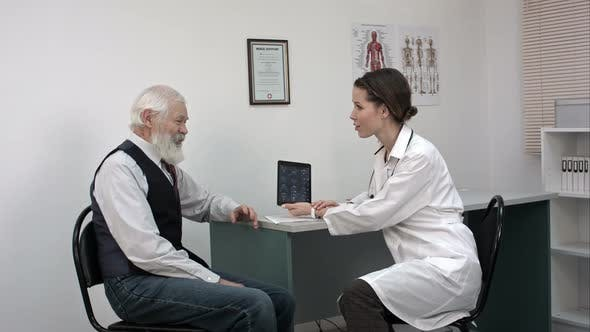

# An initutive app to allow elderly patients to have a better remote consultation and allow the doctor to track their progress 

This project uses Speech to Text, Natural language Process, Transfer Deep Learning, and Artificial Intelligence to detect symptoms from the patient's speech and then display this to the Doctor in a dashboard where they can prescribe medicines based on their previous visits and medication. This app aims to streamline the process and make it easier for both the patients and the doctors.  

Team members:  Rishi Mahadevan (backend engineer) ,Marc Phua (frontend developer) 

    

## Introduction

In Singapore, the elderly population is increasing and by 2050 it is estimated that about half of the population would be 65 years or above. Most of these are routine consultation to check on the health of the patient. Our app aims to make it a less hassel for both the patient and the doctor. 

Our app aims to also help the patients after their consultation as we let them see their prescription and also allow their care takers or themselves to take a picture of the medicine and get the dosage, frequency and the name of the medicine. It also gives a verbal dictation to help patients who have eye problems. 

## Software Architecture 

 

    

